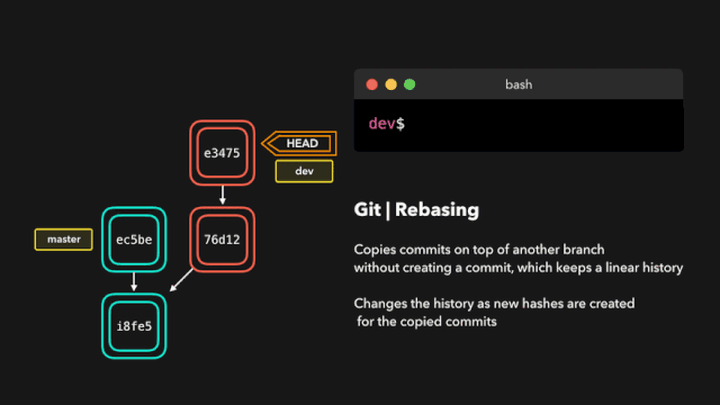

- **Basic**

```bash
git init
git add #只有add后再commit，修改才会被提交
git commit
git rm

git reset --hard HEAD^ / SHA1 
git reset filename
#git reset命令既可以回退版本，也可以把暂存区的修改撤回到工作区。
#当我们用HEAD时，表示最新的版本

git restore --stage(--worktree) <filename>#丢弃工作区修改

git status
git diff filename
git log
git reflog  #查看历史命令

git push -u origin master  #第一次推送master分支的所有内容, -u参数只在第一次push时使用

git remote -v #查看远程仓库信息
git remote rm <name> #删除远程库（解除本地和远程的绑定关系）
```

**隐藏目录 .git** (git的版本库)

- 

- **Branch**

  [可视化理解 git 操作](https://zhuanlan.zhihu.com/p/132573100)

```bash
git switch -c dev
		   -d

git fetch origin master

git pull origin master
# git fetch + git merge。当我们从来源拉取修改时，
# 我们首先是像 git fetch 那样取回所有数据，然后最新的修改会自动合并到本地分支中

git rebase 
#将当前分支的提交复制到指定的分支之上
#变基与合并有一个重大的区别：Git 不会尝试确定要保留或不保留哪些文件。
#我们执行 rebase 的分支总是含有我们想要保留的最新近的修改！
#这样我们不会遇到任何合并冲突，而且可以保留一个漂亮的、线性的 Git 历史记录。
```



